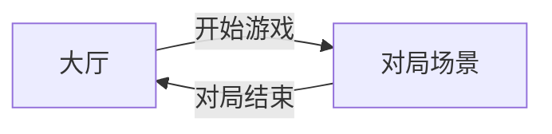

# ChessCards 简易策划案与 Godot 开发指南

## 一、策划案摘要

### 1.1 游戏定位与流程

- **类型**：四人局四色牌（十胡），1 人控 + 3 名 AI。
- **核心流程**：大厅 → 点击「开始游戏」→ 进入对局场景 → 一局结束（有人胡牌或流局）→ 返回大厅。

### 1.2 大厅（Lobby）

- **功能**：展示游戏名称/Logo、一个「开始游戏」按钮。
- **交互**：点击按钮后切换到对局场景（不保留大厅实例，或通过场景树替换）。
- **扩展预留**：可留空位给后续「设置」「规则说明」等入口。

### 1.3 对局场景（Game / Table）

- **座位与身份**：4 个座位，逆时针；座位 0 为**玩家**，座位 1～3 为 **AI**。
- **牌具**：112 张牌（4 色 × 7 种 × 4 张），发牌规则按 GAME_RULES（庄 21 张，闲 20 张）。
- **回合**：当前玩家打牌或摸牌后打牌；其他家按优先权（胡 > 杠 > 碰 > 吃）响应；吃仅限上家。
- **将/帅**：不可打出；摸到将/帅需组合法组合或按规则处理。
- **结束条件**：有人胡牌（总胡数 ≥ 10）或牌库摸完流局；结算后返回大厅。

### 1.4 规则与数据（来自 GAME_RULES.md）

- **组合类型**：对、单张将/帅、将士象、车马包、三色/四色兵卒、碰、杠。
- **胡数表**：按规则书第七节（手中/亮出分别计）；点花在叫胡后摸一张补胡数。
- **相公**：叫胡但胡数 < 10 视为相公，需赔分。
- **计分**：胡牌向其余三家收（胡数 − 10）× 倍数；流局不结算。

### 1.5 界面与表现（最小可玩）

- **大厅**：标题 + 开始按钮即可。
- **对局**：四家手牌/副露区、牌库、当前出牌区、回合/操作提示；玩家可点击出牌、吃碰杠胡按钮。
- **AI**：自动决策（随机合法操作或简单规则），有短延迟可增强可读性。

### 1.6 对局界面与可见性规则

- **信息区布局**：对局画面左侧的文本信息（牌库数量、当前回合等）须分行、分块显示（如使用 VBoxContainer），避免多个 Label 叠在同一位置造成重叠。
- **他家可见性**：玩家需能观察到其他三名玩家的局面与动作：
  - **手牌**：仅显示张数与牌背（不暴露牌面），用于判断各家剩余手牌量。
  - **副露**：已亮出的碰、杠、吃组合须展示真实牌面（规则上即为公开信息）。
  - **出牌**：当前打出的牌须在画面中央（或明确区域）展示，并标明「谁出的牌」（如「玩家2 出牌」），以便玩家看清每轮是谁出的牌、出了什么牌。
  - **打出的牌历史**：牌桌须展示**本局所有已打出的牌**（按出牌顺序），而不仅是最后一张；可用「打出的牌」区域 + 横向滚动（或仅展示最近 N 张）实现，便于玩家回顾牌序与判断局面。
- **牌组件**：单张牌组件需支持「牌面」与「牌背」两种显示模式（如 `face_down`），牌背用于他家手牌，牌面用于己方手牌、副露及当前打出的牌。**牌面颜色**：展示牌面时卡片背景按花色（红/黄/白/绿）显示对应颜色，文字保持深色便于辨认；牌背为默认灰色。
- **操作按钮可见性**：左下角「胡 / 碰 / 杠 / 吃 / 过」仅在**轮到玩家响应**时出现；且**胡、碰、杠、吃**各按钮仅在该动作**当前可执行**时显示（由 GameState 的 `can_hu` / `can_pong` / `can_kong` / `can_claim` 判定），「过」在轮到响应时始终显示以便放弃。

### 1.7 回合与响应流程（规则实现要点）

以下为与 [GAME_RULES.md](GAME_RULES.md) 第四、五节对应的实现要点，避免实现时偏离规则或出现流程卡死。

- **响应阶段与 response_order**  
  - **从手牌打出**：出牌者**不**进入响应队列，仅 **\[下家, 下下家, 下下下家]** 可响应；优先级 胡 > 杠 > 碰 > 吃，**仅下家可吃**。实现上用 `last_discard_from_draw = false`，`response_order` 不含出牌者。
  - **摸牌后打出**：出牌者**可**响应，顺序为 **\[出牌者, 下家, 下下家]**；优先级仍 胡 > 杠 > 碰 > 吃，**自己吃优先于下家吃**。实现上 `last_discard_from_draw = true`，出牌者在 `response_order` 首位。
- **响应阶段与 state_changed**  
  **每次有人「过」**（`pass_response`）**都必须触发一次 `state_changed`**，无论 `response_order` 是否已空，以便 UI 刷新并启动「下一位响应者」的 AI 计时器；若仅在 `response_order` 变空时才 emit，会导致前几家过牌后界面不刷新、下一家 AI 永不行动。

- **下家摸牌再出牌（规则 4.1、4.3）**  
  - 规则 4.1：当前玩家要么「打出一张牌」，要么「**从牌库摸一张牌后打出**」。  
  - **摸牌后**可**打出**刚摸到的那张（询问他人碰/杠/胡；若无则**下家**可吃），也可**自己吃摸出来的牌**（与手牌组成吃后须再出牌）。实现上用 `last_drawn_seat` / `last_drawn_card` 约束「若打出则只能打该张」；`can_claim_own_draw`、`do_claim_own_draw` 处理自己吃摸牌，碰/杠/吃后清除 last_drawn。  
  - 规则 4.3：若无人杠、碰，则**按正常顺序由下家摸牌**或对打出的牌行动。  
  - 因此：**所有人「过」之后，下家必须先摸一张牌，再打出一张牌（且必须打出该张）。**  
  - 实现时**不得**用「当前打出的牌是否为空」（如 `last_discard.is_empty()`）来分支「是否摸牌」：所有人过牌后，上家打出的牌仍会保留显示，`last_discard` 非空，若仅在此分支做摸牌会导致下家既不摸牌也不出牌。  
  - 正确逻辑：**是否摸牌**由以下条件决定：非「碰/杠后只出牌」、且本轮已有人出过牌（如 `last_discard_seat >= 0`）、且牌库有牌则先摸一张再出牌；**第一手**（庄家先出，`last_discard_seat < 0`）不摸牌；**碰/杠后**（`must_discard_only`）只出牌不摸牌。

- **AI 计时器与刷新**  
  使用场景内 Timer 节点驱动 AI 回合；在需要「下一动」时用 `call_deferred("_start_ai_timer")` 启动，避免同一帧内多次刷新导致计时器未生效。响应阶段由「当前 `response_order[0]` 是否为 AI」决定是否启动计时器；出牌阶段由「当前玩家是否为 AI」决定。

---

## 二、Godot 开发指南（按策划案实现）

### 2.1 项目与目录约定

- 引擎：Godot 4.6，脚本：GDScript，渲染：GL Compatibility（已配置）。
- 建议在 `res://` 下建立：
  - `scenes/`：大厅、对局、牌、桌子等场景
  - `scripts/`：各场景脚本与共享逻辑
  - `assets/`：牌面图、UI 图、字体等
  - `autoload/` 或通过 project.godot 注册的 Autoload 单例

### 2.2 场景与节点划分

| 场景   | 路径建议                      | 职责                                                                                                                                 |
|--------|-------------------------------|--------------------------------------------------------------------------------------------------------------------------------------|
| 主入口 | `scenes/main.tscn` 或 `scenes/lobby.tscn` | 作为 main scene，挂载大厅逻辑；或仅做容器，先加载 Lobby                                                                              |
| 大厅   | `scenes/lobby/lobby.tscn`     | 根节点 Control/CanvasLayer，含标题、开始按钮；按钮按下后 `get_tree().change_scene_to_file("res://scenes/game/table.tscn")`         |
| 对局   | `scenes/game/table.tscn`      | 根节点 Control，包含：牌桌 UI、4 个玩家区、牌库区、当前打出的牌、操作按钮区（吃碰杠胡）                                             |
| 单张牌 | `scenes/card/card.tscn`       | 单张牌的展示（Sprite2D/TextureRect + 脚本），数据由外部设置（花色+牌面）                                                             |

不强制 3D：2D 节点（Control + TextureRect/Sprite2D）即可实现牌面与按钮。

### 2.3 数据与规则层（建议 Autoload）

- **GameRules**（或 `game_rules.gd`）：只读常量与规则函数。
  - 牌型枚举：花色（Red/Yellow/White/Green）、牌面（King, Advisor, Elephant, Rook, Horse, Cannon, Pawn）。
  - 112 张牌生成、发牌（庄 21/闲 20）、组合类型、胡数表（手中/亮出）、是否可吃/碰/杠/胡（按上家/当前打出的牌判断）。
- **GameState**（或 `game_state.gd`）：当前对局状态单例。
  - 四家手牌、副露（碰/杠/吃亮出）、牌库、当前回合玩家、最后打出的牌、庄家；**本局打出的牌历史**（如 `discard_history`，按顺序存 { seat, card }），新局时清空。
  - 方法：发牌、出牌（同时写入打出历史）、摸牌、响应（吃碰杠胡）、结算、重置一局；**可执行判定**：`can_hu` / `can_pong` / `can_kong` / `can_claim`、`can_claim_own_draw` 供 UI 显示按钮。**摸牌后**：`last_drawn_seat` / `last_drawn_card` 记录刚摸的牌；若打出则仅可打该张；可选 `do_claim_own_draw` 自己吃该张。**打出来源**：`last_discard_from_draw` 表示最后打出的是否为摸牌后打出，决定响应顺序（自己是否在队列）及谁可吃（仅下家 vs 自己吃>下家吃）。

规则书引用：胡数计算、组合定义、优先权（胡>杠>碰>吃）、将帅不可打出等，全部以 [GAME_RULES.md](GAME_RULES.md) 与规则书第十节术语表为准，在 `GameRules` 中写注释引用对应章节。

### 2.4 大厅实现要点

- 场景：`Lobby.tscn` 根为 `Control`，内建 `CanvasLayer` 或直接用 Control 布局。
- 脚本：`Lobby.gd` 在 `_ready()` 里取「开始游戏」按钮，`pressed` 信号连接到一个方法，方法内调用：
  - `get_tree().change_scene_to_file("res://scenes/game/table.tscn")`
- 在 **Project → Project Settings → Application → Run** 中把 **Main Scene** 设为大厅场景（如 `res://scenes/lobby/lobby.tscn`）。

### 2.5 对局场景实现要点

- **Table.gd**：
  - `_ready()`：从 GameState 取或初始化一局（发牌、设庄家），生成 4 个玩家 UI（手牌、副露），其中座位 0 绑定玩家输入。
  - 刷新：根据 GameState 刷新各家手牌/副露、牌库数量、当前打出的牌、回合提示，以及「打出的牌」区域（来自 `discard_history`，可按最近 N 张 + 横向滚动）；满足 1.6 可见性规则：他家手牌用牌背、他家副露与当前打出的牌用牌面，并显示「谁出的牌」。
  - 玩家操作：点击手牌出牌、或选择「吃/碰/杠/胡」时，调用 GameState 的对应接口；若合法则更新状态并推进回合（或切换到响应者），否则提示不合法。操作按钮根据 `GameState.can_hu/can_pong/can_kong/can_claim` 控制显隐，仅可执行时显示（见 1.6 操作按钮可见性）。
- **AI 回合**：在 Table 或单独 `AIController.gd` 中，当当前玩家为 1～3 时，用 `Timer` 延迟后调用 AI 决策（例如：可胡则胡，否则可杠则杠，否则可碰则碰，否则可吃则吃，否则摸牌或出牌）；执行后更新 GameState 并刷新 UI。
- **结束判定**：每次打牌/摸牌/吃碰杠胡后，检查是否有人胡牌或流局；若结束则计算胡数/相公/计分，弹出简单结算界面（可做子场景或 Table 内 Panel），提供「返回大厅」按钮，点击后 `get_tree().change_scene_to_file("res://scenes/lobby/lobby.tscn")`。

### 2.6 牌面与资源

- 牌面数据：用 `Resource` 或字典即可（花色 + 牌面 ID）。
- 美术：每张牌一张图，或 4×7 的图集 + 在 Card 场景里按 ID 选 region；无图时可先用色块 + Label 显示「将」「车」等文字。
- 牌背：Card 组件需支持牌背模式（如 `face_down` / `set_face_down`），用于他家手牌展示，不暴露牌面。
- 花色着色：Card 在 `set_card` / `_update_label` 中根据 `GameRules.suit_color(suit)` 用 `add_theme_stylebox_override` 为 normal/hover/pressed/disabled/focus 设置 StyleBoxFlat 背景色，牌背时 `remove_theme_stylebox_override` 恢复默认；文字统一为深色以保证可读性。

### 2.7 开发顺序建议

1. **规则与数据**：实现 `GameRules`（牌型、发牌、组合、胡数表）、`GameState`（状态与回合接口），用单元测试或简单打印验证发牌与胡数计算。
2. **大厅**：做 Lobby 场景与「开始游戏」切换对局场景；Main Scene 设为大堂。
3. **对局骨架**：做 Table 场景与 Table.gd，只显示 4 个空位、牌库数量、当前玩家；用 GameState 跑一轮发牌与回合推进（不画牌面也可）。
4. **牌 UI**：做 Card 场景与列表展示手牌/副露；对接 GameState 的牌数据。
5. **玩家操作**：接出牌、吃碰杠胡按钮与 GameState，并做合法性校验与回合切换。
6. **AI**：实现 3 个座位的简单 AI（随机合法或规则优先），与 Timer 延迟。
7. **结算与返回**：胡牌/流局判定、结算界面、返回大厅；下一局可在返回大厅后再次点击开始，由 GameState 重置。

---

## 三、与规则书、项目规则的对应

- 规则实现以 [GAME_RULES.md](GAME_RULES.md) 为准，胡数、组合、优先权、将帅限制、相公、点花等均在 `GameRules`/`GameState` 中集中实现，便于维护与测试。
- 项目规范遵循 `.cursor/rules/godot-chesscards.mdc`：GDScript 带类型标注、信号在 `_ready()` 等生命周期中连接、可复用逻辑放在 Autoload 或工具类；场景与资源命名小写+下划线，与 Godot 编辑器兼容。
- **策划案同步**：每次对规则、对局流程或界面可见性做**规则性修改**时，须在本文档中对应更新（如 1.6 界面与可见性、1.7 回合与响应流程、2.3 数据与规则层、2.5 对局实现要点等），保证策划案与实现一致。

按上述策划案与开发顺序，即可在 Godot 中实现「大厅 → 一局四色牌（1 人 + 3 AI）→ 结算 → 返回大厅」的完整循环。
